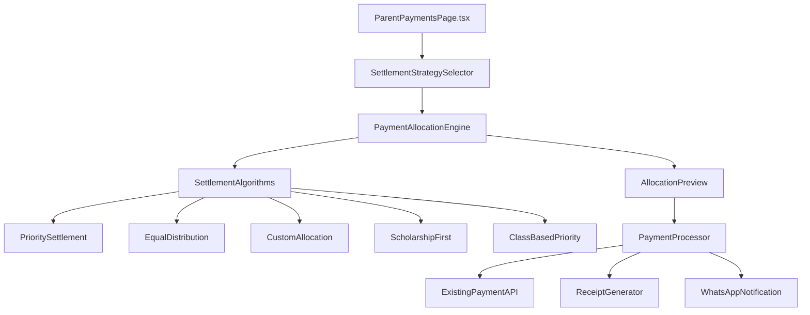

# Design Document

## Overview

The Family Payment Settlement Strategy feature extends the existing ParentPaymentsPage.tsx to provide intelligent payment allocation algorithms for multi-child families. This feature addresses the critical business problem where simple proportional allocation can result in all children being partially settled, potentially leading to all children being sent home despite payment being made.

The solution introduces five strategic settlement algorithms that maximize the number of children who remain in school during partial payments, while maintaining full compatibility with the existing payment processing infrastructure, accounting standards, and audit trail requirements.

## Architecture

### High-Level Architecture



### Integration Points

The feature integrates with existing Elite Core components:

1. **ParentPaymentsPage.tsx**: Main entry point, extends existing payment modal
2. **PaymentCalculationService**: Leverages existing calculation engine
3. **EnhancedFinancialService**: Uses existing currency formatting and financial utilities
4. **WhatsApp Integration**: Extends existing WhatsApp notification system
5. **Receipt System**: Enhances existing PDF receipt generation
6. **Accounting System**: Maintains compatibility with existing journal entries and audit trails

## Components and Interfaces

### Core Components

#### 1. SettlementStrategySelector Component

```typescript
interface SettlementStrategyProps {
  children: Child[];
  paymentAmount: number;
  onStrategyChange: (strategy: SettlementStrategy, allocation: PaymentAllocation[]) => void;
  selectedStrategy?: SettlementStrategy;
}

interface SettlementStrategy {
  id: string;
  name: string;
  description: string;
  icon: React.ReactNode;
  isAvailable: (children: Child[]) => boolean;
  calculate: (children: Child[], amount: number, options?: any) => AllocationResult;
}
```

#### 2. PaymentAllocationEngine Service

```typescript
class PaymentAllocationEngine {
  private strategies: Map<string, SettlementStrategy>;
  
  calculateAllocation(
    strategy: string, 
    children: Child[], 
    amount: number, 
    options?: AllocationOptions
  ): AllocationResult;
  
  previewAllocation(
    strategy: string, 
    children: Child[], 
    amount: number
  ): AllocationPreview;
  
  validateAllocation(allocation: PaymentAllocation[]): ValidationResult;
}
```

#### 3. AllocationPreview Component

```typescript
interface AllocationPreviewProps {
  children: Child[];
  allocations: PaymentAllocation[];
  totalAmount: number;
  strategy: SettlementStrategy;
  onConfirm: () => void;
  onModify: () => void;
}
```

### Data Models

#### Enhanced Child Interface

```typescript
interface Child {
  admission_no: string;
  student_name: string;
  class_name: string;
  class_code: string;
  balance: number;
  grade_level: number; // For class-based priority
  scholarship_percentage?: number; // For scholarship-first strategy
  effective_balance: number; // Balance after scholarships
  priority_score?: number; // Calculated priority for sorting
  checked?: boolean;
  disabled?: boolean;
  detailedBills?: BillItem[];
  paymentSummary?: PaymentSummary;
}
```

#### Settlement Strategy Types

```typescript
type StrategyType = 
  | 'PRIORITY_SETTLEMENT'
  | 'EQUAL_DISTRIBUTION' 
  | 'CUSTOM_ALLOCATION'
  | 'SCHOLARSHIP_FIRST'
  | 'CLASS_BASED_PRIORITY';

interface AllocationResult {
  success: boolean;
  allocations: PaymentAllocation[];
  summary: {
    totalAllocated: number;
    remainingAmount: number;
    fullySettledChildren: number;
    partiallySettledChildren: number;
  };
  warnings: string[];
  errors: string[];
}

interface PaymentAllocation {
  admission_no: string;
  class_code: string;
  student_name: string;
  allocated_amount: number;
  previous_balance: number;
  new_balance: number;
  is_fully_settled: boolean;
  settlement_priority: number;
}
```

## Settlement Algorithm Implementations

### 1. Priority Settlement Algorithm

**Strategy**: Settle children with lowest balances first to maximize the number of fully settled children.

```typescript
class PrioritySettlementAlgorithm implements SettlementStrategy {
  id = 'PRIORITY_SETTLEMENT';
  name = 'Priority Settlement';
  description = 'Fully settle cheapest children first';
  
  calculate(children: Child[], amount: number): AllocationResult {
    // Sort children by balance (ascending)
    const sortedChildren = [...children]
      .filter(child => child.balance > 0)
      .sort((a, b) => a.balance - b.balance);
    
    const allocations: PaymentAllocation[] = [];
    let remainingAmount = amount;
    let fullySettled = 0;
    
    for (const child of sortedChildren) {
      if (remainingAmount <= 0) break;
      
      const allocationAmount = Math.min(remainingAmount, child.balance);
      const newBalance = child.balance - allocationAmount;
      
      allocations.push({
        admission_no: child.admission_no,
        class_code: child.class_code,
        student_name: child.student_name,
        allocated_amount: allocationAmount,
        previous_balance: child.balance,
        new_balance: newBalance,
        is_fully_settled: newBalance <= 0.01,
        settlement_priority: sortedChildren.indexOf(child) + 1
      });
      
      if (newBalance <= 0.01) fullySettled++;
      remainingAmount -= allocationAmount;
    }
    
    return {
      success: true,
      allocations,
      summary: {
        totalAllocated: amount - remainingAmount,
        remainingAmount,
        fullySettledChildren: fullySettled,
        partiallySettledChildren: allocations.length - fullySettled
      },
      warnings: [],
      errors: []
    };
  }
}
```

### 2. Equal Distribution Algorithm

**Strategy**: Distribute payment equally among all children with outstanding balances.

```typescript
class EqualDistributionAlgorithm implements SettlementStrategy {
  id = 'EQUAL_DISTRIBUTION';
  name = 'Equal Distribution';
  description = 'Split payment equally among all children';
  
  calculate(children: Child[], amount: number): AllocationResult {
    const eligibleChildren = children.filter(child => child.balance > 0);
    if (eligibleChildren.length === 0) {
      return this.createEmptyResult();
    }
    
    const baseAmount = Math.floor((amount * 100) / eligibleChildren.length) / 100;
    const remainder = amount - (baseAmount * eligibleChildren.length);
    
    // Sort by balance descending to distribute remainder to highest balances
    const sortedChildren = [...eligibleChildren]
      .sort((a, b) => b.balance - a.balance);
    
    const allocations: PaymentAllocation[] = [];
    let fullySettled = 0;
    
    sortedChildren.forEach((child, index) => {
      const extraAmount = index < remainder * 100 ? 0.01 : 0;
      const totalAllocation = baseAmount + extraAmount;
      const allocationAmount = Math.min(totalAllocation, child.balance);
      const newBalance = child.balance - allocationAmount;
      
      allocations.push({
        admission_no: child.admission_no,
        class_code: child.class_code,
        student_name: child.student_name,
        allocated_amount: allocationAmount,
        previous_balance: child.balance,
        new_balance: newBalance,
        is_fully_settled: newBalance <= 0.01,
        settlement_priority: index + 1
      });
      
      if (newBalance <= 0.01) fullySettled++;
    });
    
    // Redistribute any excess from capped allocations
    const totalAllocated = allocations.reduce((sum, alloc) => sum + alloc.allocated_amount, 0);
    const excess = amount - totalAllocated;
    
    if (excess > 0.01) {
      this.redistributeExcess(allocations, excess);
    }
    
    return {
      success: true,
      allocations,
      summary: {
        totalAllocated: allocations.reduce((sum, alloc) => sum + alloc.allocated_amount, 0),
        remainingAmount: amount - allocations.reduce((sum, alloc) => sum + alloc.allocated_amount, 0),
        fullySettledChildren: fullySettled,
        partiallySettledChildren: allocations.length - fullySettled
      },
      warnings: [],
      errors: []
    };
  }
  
  private redistributeExcess(allocations: PaymentAllocation[], excess: number): void {
    // Redistribute excess to children who aren't fully settled, starting with highest balances
    const unsettledAllocations = allocations
      .filter(alloc => !alloc.is_fully_settled)
      .sort((a, b) => b.new_balance - a.new_balance);
    
    let remainingExcess = excess;
    
    for (const allocation of unsettledAllocations) {
      if (remainingExcess <= 0.01) break;
      
      const additionalAmount = Math.min(remainingExcess, allocation.new_balance);
      allocation.allocated_amount += additionalAmount;
      allocation.new_balance -= additionalAmount;
      allocation.is_fully_settled = allocation.new_balance <= 0.01;
      remainingExcess -= additionalAmount;
    }
  }
}
```

### 3. Scholarship-First Algorithm

**Strategy**: Prioritize children with scholarships to maximize the number of settled children by leveraging discounts.

```typescript
class ScholarshipFirstAlgorithm implements SettlementStrategy {
  id = 'SCHOLARSHIP_FIRST';
  name = 'Scholarship-First';
  description = 'Prioritize children with scholarships';
  
  calculate(children: Child[], amount: number): AllocationResult {
    // Separate scholarship and non-scholarship children
    const scholarshipChildren = children
      .filter(child => child.balance > 0 && (child.scholarship_percentage || 0) > 0)
      .sort((a, b) => a.effective_balance - b.effective_balance);
    
    const regularChildren = children
      .filter(child => child.balance > 0 && (child.scholarship_percentage || 0) === 0)
      .sort((a, b) => a.balance - b.balance);
    
    const allocations: PaymentAllocation[] = [];
    let remainingAmount = amount;
    let fullySettled = 0;
    
    // First, settle scholarship children using Priority Settlement
    for (const child of scholarshipChildren) {
      if (remainingAmount <= 0) break;
      
      const allocationAmount = Math.min(remainingAmount, child.effective_balance);
      const newBalance = child.effective_balance - allocationAmount;
      
      allocations.push({
        admission_no: child.admission_no,
        class_code: child.class_code,
        student_name: child.student_name,
        allocated_amount: allocationAmount,
        previous_balance: child.effective_balance,
        new_balance: newBalance,
        is_fully_settled: newBalance <= 0.01,
        settlement_priority: scholarshipChildren.indexOf(child) + 1
      });
      
      if (newBalance <= 0.01) fullySettled++;
      remainingAmount -= allocationAmount;
    }
    
    // Then, settle regular children with remaining amount
    for (const child of regularChildren) {
      if (remainingAmount <= 0) break;
      
      const allocationAmount = Math.min(remainingAmount, child.balance);
      const newBalance = child.balance - allocationAmount;
      
      allocations.push({
        admission_no: child.admission_no,
        class_code: child.class_code,
        student_name: child.student_name,
        allocated_amount: allocationAmount,
        previous_balance: child.balance,
        new_balance: newBalance,
        is_fully_settled: newBalance <= 0.01,
        settlement_priority: scholarshipChildren.length + regularChildren.indexOf(child) + 1
      });
      
      if (newBalance <= 0.01) fullySettled++;
      remainingAmount -= allocationAmount;
    }
    
    return {
      success: true,
      allocations,
      summary: {
        totalAllocated: amount - remainingAmount,
        remainingAmount,
        fullySettledChildren: fullySettled,
        partiallySettledChildren: allocations.length - fullySettled
      },
      warnings: scholarshipChildren.length === 0 ? ['No scholarship children found'] : [],
      errors: []
    };
  }
}
```

### 4. Class-Based Priority Algorithm

**Strategy**: Prioritize children by grade level (graduating first or youngest first).

```typescript
class ClassBasedPriorityAlgorithm implements SettlementStrategy {
  id = 'CLASS_BASED_PRIORITY';
  name = 'Class-Based Priority';
  description = 'Prioritize by grade level';
  
  calculate(children: Child[], amount: number, options?: { priorityOrder: 'GRADUATING_FIRST' | 'YOUNGEST_FIRST' }): AllocationResult {
    const priorityOrder = options?.priorityOrder || 'GRADUATING_FIRST';
    
    // Sort children by grade level, then by balance within same grade
    const sortedChildren = [...children]
      .filter(child => child.balance > 0)
      .sort((a, b) => {
        // Primary sort: grade level
        const gradeSort = priorityOrder === 'GRADUATING_FIRST' 
          ? b.grade_level - a.grade_level  // Higher grades first
          : a.grade_level - b.grade_level; // Lower grades first
        
        if (gradeSort !== 0) return gradeSort;
        
        // Secondary sort: balance (lowest first within same grade)
        return a.balance - b.balance;
      });
    
    // Apply Priority Settlement algorithm to sorted children
    const priorityAlgorithm = new PrioritySettlementAlgorithm();
    const result = priorityAlgorithm.calculate(sortedChildren, amount);
    
    // Update priority scores to reflect class-based ordering
    result.allocations.forEach((allocation, index) => {
      allocation.settlement_priority = index + 1;
    });
    
    return {
      ...result,
      warnings: [
        ...result.warnings,
        `Applied ${priorityOrder === 'GRADUATING_FIRST' ? 'graduating classes first' : 'youngest children first'} priority`
      ]
    };
  }
}
```

### 5. Custom Allocation Algorithm

**Strategy**: Allow manual specification of amounts per child with validation and auto-distribution of remaining amounts.

```typescript
class CustomAllocationAlgorithm implements SettlementStrategy {
  id = 'CUSTOM_ALLOCATION';
  name = 'Custom Allocation';
  description = 'Manually specify amounts per child';
  
  calculate(children: Child[], amount: number, options?: { customAllocations: Record<string, number> }): AllocationResult {
    const customAllocations = options?.customAllocations || {};
    const allocations: PaymentAllocation[] = [];
    const errors: string[] = [];
    const warnings: string[] = [];
    
    let totalCustomAllocated = 0;
    let fullySettled = 0;
    
    // Process custom allocations
    for (const child of children.filter(c => c.balance > 0)) {
      const customAmount = customAllocations[child.admission_no] || 0;
      
      if (customAmount > child.balance) {
        warnings.push(`${child.student_name}: Allocation (₦${customAmount}) exceeds balance (₦${child.balance})`);
      }
      
      const allocationAmount = Math.min(customAmount, child.balance);
      const newBalance = child.balance - allocationAmount;
      
      if (allocationAmount > 0) {
        allocations.push({
          admission_no: child.admission_no,
          class_code: child.class_code,
          student_name: child.student_name,
          allocated_amount: allocationAmount,
          previous_balance: child.balance,
          new_balance: newBalance,
          is_fully_settled: newBalance <= 0.01,
          settlement_priority: 1 // Custom allocations have priority
        });
        
        if (newBalance <= 0.01) fullySettled++;
        totalCustomAllocated += allocationAmount;
      }
    }
    
    // Validate total doesn't exceed payment amount
    if (totalCustomAllocated > amount) {
      errors.push(`Total custom allocations (₦${totalCustomAllocated}) exceed payment amount (₦${amount})`);
      return {
        success: false,
        allocations: [],
        summary: { totalAllocated: 0, remainingAmount: amount, fullySettledChildren: 0, partiallySettledChildren: 0 },
        warnings,
        errors
      };
    }
    
    // Auto-distribute remaining amount using Priority Settlement
    const remainingAmount = amount - totalCustomAllocated;
    if (remainingAmount > 0.01) {
      const unallocatedChildren = children.filter(child => 
        child.balance > 0 && !customAllocations[child.admission_no]
      );
      
      if (unallocatedChildren.length > 0) {
        const priorityAlgorithm = new PrioritySettlementAlgorithm();
        const remainingResult = priorityAlgorithm.calculate(unallocatedChildren, remainingAmount);
        
        // Add remaining allocations with lower priority
        remainingResult.allocations.forEach(allocation => {
          allocation.settlement_priority = 2; // Lower priority than custom
          allocations.push(allocation);
          if (allocation.is_fully_settled) fullySettled++;
        });
        
        warnings.push(`Auto-distributed remaining ₦${remainingAmount} using Priority Settlement`);
      }
    }
    
    return {
      success: true,
      allocations,
      summary: {
        totalAllocated: allocations.reduce((sum, alloc) => sum + alloc.allocated_amount, 0),
        remainingAmount: amount - allocations.reduce((sum, alloc) => sum + alloc.allocated_amount, 0),
        fullySettledChildren: fullySettled,
        partiallySettledChildren: allocations.length - fullySettled
      },
      warnings,
      errors
    };
  }
}
```

## User Interface Design

### Settlement Strategy Selection Interface

The interface will be integrated into the existing payment modal in ParentPaymentsPage.tsx:

```typescript
// Enhanced Payment Modal with Settlement Strategy
const PaymentModal = () => {
  return (
    <Modal title="Process Family Payment" width={1400}>
      {/* Existing family and children information */}
      
      {/* NEW: Settlement Strategy Section */}
      <Card title="Payment Settlement Strategy" style={{ marginBottom: 16 }}>
        <SettlementStrategySelector
          children={childrenData}
          paymentAmount={paymentFormData.amount}
          onStrategyChange={handleStrategyChange}
          selectedStrategy={selectedStrategy}
        />
      </Card>
      
      {/* NEW: Allocation Preview Section */}
      {allocationPreview && (
        <Card title="Payment Allocation Preview" style={{ marginBottom: 16 }}>
          <AllocationPreview
            children={childrenData}
            allocations={allocationPreview.allocations}
            totalAmount={paymentFormData.amount}
            strategy={selectedStrategy}
            onConfirm={handleProcessPayment}
            onModify={() => setShowCustomAllocation(true)}
          />
        </Card>
      )}
      
      {/* Existing payment form fields */}
    </Modal>
  );
};
```

### Strategy Selection Component

```typescript
const SettlementStrategySelector: React.FC<SettlementStrategyProps> = ({
  children,
  paymentAmount,
  onStrategyChange,
  selectedStrategy
}) => {
  const strategies = [
    {
      id: 'PRIORITY_SETTLEMENT',
      name: 'Priority Settlement',
      description: 'Fully settle cheapest children first',
      icon: <SortAscendingOutlined />,
      recommended: true
    },
    {
      id: 'EQUAL_DISTRIBUTION',
      name: 'Equal Distribution',
      description: 'Split payment equally among all children',
      icon: <PercentageOutlined />
    },
    {
      id: 'SCHOLARSHIP_FIRST',
      name: 'Scholarship-First',
      description: 'Prioritize children with scholarships',
      icon: <TrophyOutlined />,
      available: children.some(c => c.scholarship_percentage > 0)
    },
    {
      id: 'CLASS_BASED_PRIORITY',
      name: 'Class-Based Priority',
      description: 'Prioritize by grade level',
      icon: <BookOutlined />
    },
    {
      id: 'CUSTOM_ALLOCATION',
      name: 'Custom Allocation',
      description: 'Manually specify amounts per child',
      icon: <EditOutlined />
    }
  ];

  return (
    <Row gutter={[16, 16]}>
      {strategies.map(strategy => (
        <Col key={strategy.id} xs={24} sm={12} lg={8}>
          <Card
            hoverable
            className={selectedStrategy?.id === strategy.id ? 'selected-strategy' : ''}
            onClick={() => handleStrategySelect(strategy)}
            style={{
              border: selectedStrategy?.id === strategy.id ? '2px solid #1890ff' : '1px solid #d9d9d9'
            }}
          >
            <Space direction="vertical" align="center" style={{ width: '100%' }}>
              <div style={{ fontSize: '24px', color: '#1890ff' }}>
                {strategy.icon}
              </div>
              <Title level={5} style={{ margin: 0 }}>
                {strategy.name}
                {strategy.recommended && <Tag color="gold" style={{ marginLeft: 8 }}>Recommended</Tag>}
              </Title>
              <Text type="secondary" style={{ textAlign: 'center' }}>
                {strategy.description}
              </Text>
            </Space>
          </Card>
        </Col>
      ))}
    </Row>
  );
};
```

### Allocation Preview Component

```typescript
const AllocationPreview: React.FC<AllocationPreviewProps> = ({
  children,
  allocations,
  totalAmount,
  strategy,
  onConfirm,
  onModify
}) => {
  const columns = [
    {
      title: 'Student',
      dataIndex: 'student_name',
      key: 'student_name',
      render: (name: string, record: PaymentAllocation) => (
        <Space direction="vertical" size={0}>
          <Text strong>{name}</Text>
          <Text type="secondary" style={{ fontSize: '12px' }}>
            {record.class_code}
          </Text>
        </Space>
      )
    },
    {
      title: 'Previous Balance',
      dataIndex: 'previous_balance',
      key: 'previous_balance',
      render: (balance: number) => (
        <Text type="danger">
          {EnhancedFinancialService.formatCurrency(balance)}
        </Text>
      )
    },
    {
      title: 'Payment Allocation',
      dataIndex: 'allocated_amount',
      key: 'allocated_amount',
      render: (amount: number) => (
        <Text strong style={{ color: '#52c41a' }}>
          {EnhancedFinancialService.formatCurrency(amount)}
        </Text>
      )
    },
    {
      title: 'New Balance',
      dataIndex: 'new_balance',
      key: 'new_balance',
      render: (balance: number, record: PaymentAllocation) => (
        <Space>
          <Text type={balance <= 0.01 ? 'success' : 'danger'}>
            {EnhancedFinancialService.formatCurrency(balance)}
          </Text>
          {record.is_fully_settled && (
            <Tag color="green" icon={<CheckCircleOutlined />}>
              Fully Settled
            </Tag>
          )}
        </Space>
      )
    },
    {
      title: 'Priority',
      dataIndex: 'settlement_priority',
      key: 'settlement_priority',
      render: (priority: number) => (
        <Tag color="blue">#{priority}</Tag>
      )
    }
  ];

  const summary = allocations.reduce(
    (acc, alloc) => ({
      totalAllocated: acc.totalAllocated + alloc.allocated_amount,
      fullySettled: acc.fullySettled + (alloc.is_fully_settled ? 1 : 0),
      partiallySettled: acc.partiallySettled + (alloc.is_fully_settled ? 0 : 1)
    }),
    { totalAllocated: 0, fullySettled: 0, partiallySettled: 0 }
  );

  return (
    <div>
      {/* Summary Statistics */}
      <Row gutter={16} style={{ marginBottom: 16 }}>
        <Col span={6}>
          <Statistic
            title="Total Payment"
            value={totalAmount}
            formatter={(value) => EnhancedFinancialService.formatCurrency(Number(value))}
            valueStyle={{ color: '#1890ff' }}
          />
        </Col>
        <Col span={6}>
          <Statistic
            title="Fully Settled"
            value={summary.fullySettled}
            suffix={`/ ${allocations.length} children`}
            valueStyle={{ color: '#52c41a' }}
          />
        </Col>
        <Col span={6}>
          <Statistic
            title="Partially Settled"
            value={summary.partiallySettled}
            suffix="children"
            valueStyle={{ color: '#fa8c16' }}
          />
        </Col>
        <Col span={6}>
          <Statistic
            title="Remaining"
            value={totalAmount - summary.totalAllocated}
            formatter={(value) => EnhancedFinancialService.formatCurrency(Number(value))}
            valueStyle={{ color: totalAmount - summary.totalAllocated > 0 ? '#fa8c16' : '#52c41a' }}
          />
        </Col>
      </Row>

      {/* Allocation Table */}
      <Table
        dataSource={allocations}
        columns={columns}
        rowKey="admission_no"
        pagination={false}
        size="small"
        style={{ marginBottom: 16 }}
      />

      {/* Action Buttons */}
      <Row justify="end" gutter={8}>
        <Col>
          <Button onClick={onModify}>
            Modify Allocation
          </Button>
        </Col>
        <Col>
          <Button type="primary" onClick={onConfirm}>
            Confirm Payment
          </Button>
        </Col>
      </Row>
    </div>
  );
};
```

## Data Models

### Enhanced Payment Data Structure

```typescript
interface EnhancedPaymentData extends PaymentData {
  settlement_strategy: StrategyType;
  settlement_options?: Record<string, any>;
  allocation_details: PaymentAllocation[];
  settlement_summary: {
    total_allocated: number;
    remaining_amount: number;
    fully_settled_count: number;
    partially_settled_count: number;
    strategy_effectiveness_score: number; // 0-100 based on children kept in school
  };
}
```

### Database Schema Extensions

The feature will extend existing payment tables with settlement strategy information:

```sql
-- Add settlement strategy columns to payment_entries table
ALTER TABLE payment_entries ADD COLUMN settlement_strategy VARCHAR(50) DEFAULT 'PRIORITY_SETTLEMENT';
ALTER TABLE payment_entries ADD COLUMN settlement_options JSON;
ALTER TABLE payment_entries ADD COLUMN allocation_summary JSON;

-- Create settlement strategy analytics table
CREATE TABLE settlement_strategy_analytics (
  id INT PRIMARY KEY AUTO_INCREMENT,
  school_id VARCHAR(50) NOT NULL,
  branch_id VARCHAR(50) NOT NULL,
  academic_year VARCHAR(20) NOT NULL,
  term VARCHAR(20) NOT NULL,
  strategy_type VARCHAR(50) NOT NULL,
  family_count INT DEFAULT 0,
  total_amount DECIMAL(15,2) DEFAULT 0,
  avg_children_per_family DECIMAL(5,2) DEFAULT 0,
  avg_fully_settled_ratio DECIMAL(5,4) DEFAULT 0,
  effectiveness_score DECIMAL(5,2) DEFAULT 0,
  created_at TIMESTAMP DEFAULT CURRENT_TIMESTAMP,
  updated_at TIMESTAMP DEFAULT CURRENT_TIMESTAMP ON UPDATE CURRENT_TIMESTAMP,
  INDEX idx_school_analytics (school_id, academic_year, term),
  INDEX idx_strategy_analytics (strategy_type, created_at)
);
```

Now I need to use the prework tool to analyze the acceptance criteria before writing the correctness properties:

<function_calls>
<invoke name="prework">
<parameter name="featureName">family-payment-settlement-strategy

## Correctness Properties

*A property is a characteristic or behavior that should hold true across all valid executions of a system-essentially, a formal statement about what the system should do. Properties serve as the bridge between human-readable specifications and machine-verifiable correctness guarantees.*

### Property Reflection

After analyzing all acceptance criteria, I identified several areas where properties can be consolidated to eliminate redundancy:

- **Settlement Strategy Properties**: Multiple criteria test similar allocation logic across different strategies. These can be consolidated into comprehensive properties that test allocation correctness across all strategies.
- **UI Display Properties**: Several criteria test UI display behavior. These can be combined into properties that verify consistent UI behavior across all settlement scenarios.
- **Validation Properties**: Multiple validation-related criteria can be consolidated into comprehensive validation properties.
- **Integration Properties**: Several criteria test integration with existing systems. These can be combined into properties that verify seamless integration across all payment scenarios.

### Core Settlement Properties

#### Property 1: Settlement Strategy Allocation Correctness
*For any* family with multiple children and any partial payment amount, when any settlement strategy is applied, the total allocated amount should never exceed the payment amount, and no child should receive more than their outstanding balance.
**Validates: Requirements 1.2, 2.2, 2.3, 2.4, 3.1, 3.2, 3.3, 3.4, 3.5, 4.2, 4.4, 5.2, 5.3, 6.2, 6.3, 6.4**

#### Property 2: Priority Settlement Optimization
*For any* set of children with different outstanding balances and any payment amount, Priority Settlement should maximize the number of fully settled children compared to proportional allocation.
**Validates: Requirements 2.1, 2.2, 2.3, 2.4, 2.5**

#### Property 3: Equal Distribution Fairness
*For any* family with children having outstanding balances, Equal Distribution should allocate amounts such that the difference between any two children's allocations is at most one cent (accounting for remainder distribution).
**Validates: Requirements 3.1, 3.2, 3.3, 3.4, 3.5**

#### Property 4: Scholarship-First Effectiveness
*For any* family with both scholarship and non-scholarship children, Scholarship-First strategy should prioritize scholarship children and result in equal or better settlement outcomes compared to Priority Settlement.
**Validates: Requirements 5.1, 5.2, 5.3, 5.4, 5.5**

#### Property 5: Custom Allocation Validation
*For any* custom allocation input, the system should validate that individual allocations do not exceed child balances and total allocations do not exceed payment amount, with appropriate warnings and auto-distribution of remaining amounts.
**Validates: Requirements 4.1, 4.2, 4.3, 4.4, 4.5**

#### Property 6: Class-Based Priority Ordering
*For any* family with children in different grade levels, Class-Based Priority should order children according to the selected priority direction (graduating first or youngest first) with balance-based tiebreaking within same grades.
**Validates: Requirements 6.1, 6.2, 6.3, 6.4, 6.5**

### System Integration Properties

#### Property 7: Payment Processing Integration
*For any* settlement strategy and payment method combination, the payment should be processed using existing payment validation, security measures, and accounting mechanisms while preserving all existing functionality.
**Validates: Requirements 10.1, 10.2, 10.3, 10.4, 10.5**

#### Property 8: Overpayment Handling Consistency
*For any* payment amount that exceeds total family balance, the system should fully settle all children first, then credit the excess to the family account, with proper display in previews and receipts.
**Validates: Requirements 8.1, 8.2, 8.3, 8.4, 8.5**

#### Property 9: Settlement History Persistence
*For any* processed payment with settlement strategy, the system should record the strategy used, detailed allocation information, and maintain audit trail for reporting and analytics.
**Validates: Requirements 9.1, 9.2, 9.3, 9.4, 9.5**

### User Interface Properties

#### Property 10: Settlement Preview Accuracy
*For any* selected settlement strategy and payment amount, the allocation preview should accurately display before/after balances, settlement status, and total allocations matching the actual processing results.
**Validates: Requirements 7.1, 7.2, 7.3, 7.4, 7.5**

#### Property 11: Strategy Availability and Selection
*For any* family payment scenario, the system should present available settlement strategies based on family characteristics (scholarships, grade levels) and allow strategy selection with immediate preview updates.
**Validates: Requirements 1.1, 1.3, 1.4, 1.5**

#### Property 12: Mobile Interface Consistency
*For any* device size and settlement strategy interaction, the interface should maintain full functionality with appropriate responsive design patterns and touch-friendly controls.
**Validates: Requirements 12.1, 12.2, 12.3, 12.4, 12.5**

### Communication and Notification Properties

#### Property 13: WhatsApp Settlement Notifications
*For any* processed payment with settlement strategy, when WhatsApp is available, the system should send notifications with settlement details and receipt PDF, with fallback to alternative methods when unavailable.
**Validates: Requirements 13.1, 13.2, 13.3, 13.4, 13.5**

### Administrative and Policy Properties

#### Property 14: Policy Enforcement and Override
*For any* configured school policy (minimum payments, strategy restrictions), the system should enforce policies during settlement while allowing administrative overrides for special circumstances.
**Validates: Requirements 11.1, 11.2, 11.3, 11.4, 11.5**

### Bulk Processing Properties

#### Property 15: Bulk Payment Processing Integrity
*For any* batch of family payments with individual settlement strategies, the system should process each payment independently with proper validation, error isolation, and consolidated reporting.
**Validates: Requirements 14.1, 14.2, 14.3, 14.4, 14.5**

### Analytics Properties

#### Property 16: Settlement Analytics Accuracy
*For any* collection of processed payments with settlement strategies, the analytics system should accurately track usage patterns, effectiveness metrics, and provide insights for financial counseling and policy optimization.
**Validates: Requirements 15.1, 15.2, 15.3, 15.4, 15.5**

## Error Handling

### Settlement Strategy Error Scenarios

1. **Invalid Payment Amount**: Handle negative or zero payment amounts
2. **No Eligible Children**: Handle families where all children have zero balance
3. **Calculation Overflow**: Handle edge cases with very large payment amounts
4. **Strategy Unavailability**: Handle cases where selected strategy is not applicable
5. **Custom Allocation Errors**: Handle invalid custom allocation inputs
6. **Network Failures**: Handle API failures during payment processing
7. **WhatsApp Service Errors**: Handle WhatsApp notification failures with fallbacks

### Error Recovery Mechanisms

```typescript
interface ErrorRecoveryStrategy {
  errorType: string;
  recoveryAction: 'RETRY' | 'FALLBACK' | 'USER_INTERVENTION' | 'ABORT';
  fallbackStrategy?: StrategyType;
  userMessage: string;
  logLevel: 'INFO' | 'WARN' | 'ERROR' | 'CRITICAL';
}

const errorRecoveryStrategies: ErrorRecoveryStrategy[] = [
  {
    errorType: 'STRATEGY_CALCULATION_FAILED',
    recoveryAction: 'FALLBACK',
    fallbackStrategy: 'PRIORITY_SETTLEMENT',
    userMessage: 'Selected strategy failed. Using Priority Settlement as fallback.',
    logLevel: 'WARN'
  },
  {
    errorType: 'PAYMENT_PROCESSING_FAILED',
    recoveryAction: 'USER_INTERVENTION',
    userMessage: 'Payment processing failed. Please verify payment details and try again.',
    logLevel: 'ERROR'
  },
  {
    errorType: 'WHATSAPP_NOTIFICATION_FAILED',
    recoveryAction: 'FALLBACK',
    userMessage: 'WhatsApp notification failed. Receipt will be available for download.',
    logLevel: 'INFO'
  }
];
```

## Testing Strategy

### Dual Testing Approach

The testing strategy combines unit tests for specific scenarios and property-based tests for comprehensive coverage:

**Unit Tests Focus:**
- Specific settlement strategy examples with known inputs/outputs
- Edge cases (zero balances, single child families, exact payment matches)
- Error conditions and recovery scenarios
- UI component rendering and interaction
- Integration points with existing systems

**Property-Based Tests Focus:**
- Universal settlement properties across all strategies and input combinations
- Allocation correctness across random family configurations
- Mathematical invariants (total allocation ≤ payment amount)
- UI consistency across different device sizes and data sets
- End-to-end payment processing with random valid inputs

### Property-Based Testing Configuration

**Testing Framework**: Fast-check (JavaScript property-based testing library)
**Minimum Iterations**: 100 per property test
**Test Tagging**: Each property test references its design document property

Example property test structure:
```typescript
// Feature: family-payment-settlement-strategy, Property 1: Settlement Strategy Allocation Correctness
describe('Settlement Strategy Allocation Correctness', () => {
  it('should never exceed payment amount or child balances', () => {
    fc.assert(fc.property(
      familyGenerator, // Generates random families with children and balances
      paymentAmountGenerator, // Generates random payment amounts
      strategyGenerator, // Generates random settlement strategies
      (family, paymentAmount, strategy) => {
        const result = paymentAllocationEngine.calculateAllocation(
          strategy, family.children, paymentAmount
        );
        
        // Property assertions
        const totalAllocated = result.allocations.reduce((sum, alloc) => sum + alloc.allocated_amount, 0);
        expect(totalAllocated).toBeLessThanOrEqual(paymentAmount);
        
        result.allocations.forEach(allocation => {
          const child = family.children.find(c => c.admission_no === allocation.admission_no);
          expect(allocation.allocated_amount).toBeLessThanOrEqual(child.balance);
        });
      }
    ), { numRuns: 100 });
  });
});
```

### Integration Testing

**API Integration Tests:**
- Test settlement strategies with existing payment API endpoints
- Verify receipt generation includes settlement strategy information
- Test WhatsApp integration with settlement notifications
- Validate accounting system integration with settlement data

**Database Integration Tests:**
- Test settlement strategy data persistence
- Verify audit trail includes settlement information
- Test analytics data collection and reporting
- Validate data migration and backward compatibility

### Performance Testing

**Load Testing Scenarios:**
- Bulk family payment processing with different strategies
- Concurrent settlement strategy calculations
- Large family sizes (10+ children) with complex allocations
- Mobile interface performance with large datasets

**Performance Benchmarks:**
- Settlement strategy calculation: < 100ms for families up to 10 children
- Allocation preview generation: < 200ms
- Payment processing with settlement: < 2 seconds end-to-end
- Mobile interface responsiveness: < 300ms for UI updates