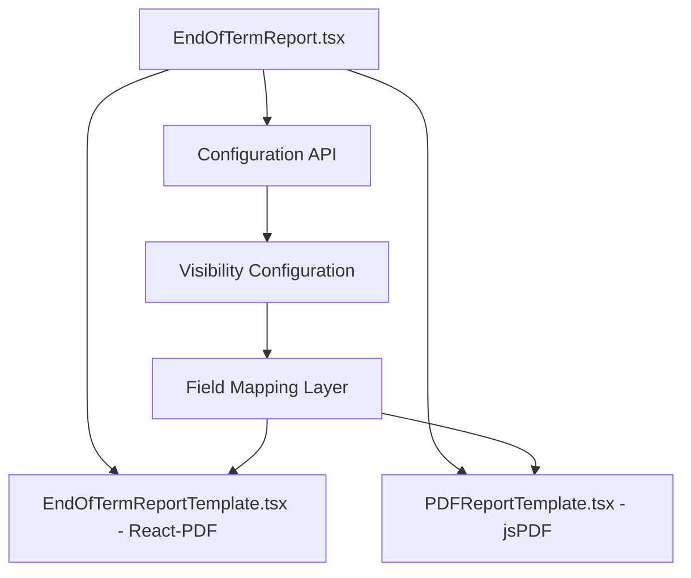
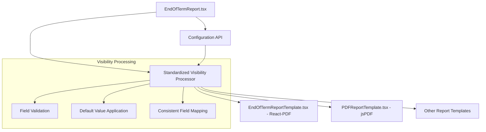

# Design Document

## Overview

The End of Term Report system currently has inconsistent visibility control implementation across different report templates. The system uses two main template types: React-PDF (`EndOfTermReportTemplate.tsx`) and jsPDF (`PDFReportTemplate.tsx`), each handling visibility configuration differently. This design addresses the inconsistencies by standardizing the visibility logic, field mapping, and error handling across all templates.

## Architecture

### Current System Architecture



### Target System Architecture



## Components and Interfaces

### 1. Visibility Configuration Interface

```typescript
interface ReportVisibilityConfig {
  showAttendancePerformance: boolean;
  showCharacterAssessment: boolean;
  showTeacherRemarks: boolean;
  showPrincipalRemarks: boolean;
  // Other existing fields...
}

interface ProcessedVisibilityConfig {
  showAttendancePerformance: boolean;
  showCharacterAssessment: boolean;
  showTeacherRemarks: boolean;
  showPrincipalRemarks: boolean;
  // Standardized field names for all templates
}
```

### 2. Visibility Processor Component

A centralized processor that handles:
- Configuration validation
- Default value application
- Consistent field mapping
- Error handling

```typescript
class VisibilityProcessor {
  static processConfiguration(
    apiConfig: any
  ): ProcessedVisibilityConfig;
  
  static validateConfiguration(
    config: any
  ): ValidationResult;
  
  static applyDefaults(
    config: Partial<ReportVisibilityConfig>
  ): ReportVisibilityConfig;
}
```

### 3. Template Visibility Handler

A standardized handler for all templates:

```typescript
interface TemplateVisibilityHandler {
  shouldShowAttendance(
    config: ProcessedVisibilityConfig,
    data: any
  ): boolean;
  
  shouldShowCharacterAssessment(
    config: ProcessedVisibilityConfig,
    data: any
  ): boolean;
  
  shouldShowTeacherRemarks(
    config: ProcessedVisibilityConfig,
    data: any
  ): boolean;
  
  shouldShowPrincipalRemarks(
    config: ProcessedVisibilityConfig,
    data: any
  ): boolean;
}
```

## Data Models

### Current Field Mapping Issues

**EndOfTermReportTemplate.tsx (React-PDF)**:
- Maps `showAttendancePerformance` → `showAttendance`
- Uses mapped field names in visibility checks
- Inconsistent with jsPDF template

**PDFReportTemplate.tsx (jsPDF)**:
- Uses direct API field names
- Pattern: `config?.visibility?.fieldName !== false`
- More consistent approach

### Standardized Data Model

```typescript
interface StandardizedVisibilityConfig {
  // Direct API field names (no mapping)
  showAttendancePerformance: boolean;
  showCharacterAssessment: boolean;
  showTeacherRemarks: boolean;
  showPrincipalRemarks: boolean;
}

interface VisibilityDefaults {
  readonly DEFAULT_SHOW_ATTENDANCE: boolean = true;
  readonly DEFAULT_SHOW_CHARACTER: boolean = true;
  readonly DEFAULT_SHOW_TEACHER_REMARKS: boolean = true;
  readonly DEFAULT_SHOW_PRINCIPAL_REMARKS: boolean = true;
}
```

## Correctness Properties

*A property is a characteristic or behavior that should hold true across all valid executions of a system-essentially, a formal statement about what the system should do. Properties serve as the bridge between human-readable specifications and machine-verifiable correctness guarantees.*

Now I need to analyze the acceptance criteria to create correctness properties:

<function_calls>
<invoke name="prework">
<parameter name="featureName">report-configuration-visibility-fix

### Property Reflection

After analyzing the acceptance criteria, I identified several areas where properties can be consolidated to eliminate redundancy:

- **Visibility Control**: Properties 1.1, 2.1, 3.1, 4.1 all test the same pattern (field=false → section hidden)
- **Positive Cases**: Properties 1.2, 2.2, 3.2, 4.2 all test the same pattern (field=true + data exists → section shown)
- **Default Behavior**: Properties 1.3, 2.3, 3.3, 4.3 all test fallback behavior
- **Template Consistency**: Properties 1.4, 1.5, 2.4, 3.4, 4.4, 5.1, 5.2, 5.3 can be consolidated

The following properties provide comprehensive coverage without redundancy:

### Property 1: Visibility Control Universality
*For any* report configuration and any visibility field (showAttendancePerformance, showCharacterAssessment, showTeacherRemarks, showPrincipalRemarks), when that field is set to false, all report templates should hide the corresponding section completely
**Validates: Requirements 1.1, 2.1, 3.1, 4.1**

### Property 2: Positive Visibility with Data
*For any* report configuration and any visibility field, when that field is set to true and corresponding data exists, all report templates should display the corresponding section
**Validates: Requirements 1.2, 2.2, 3.2, 4.2**

### Property 3: Default Visibility Behavior
*For any* report configuration with missing or undefined visibility fields, all report templates should default to showing all sections (true behavior)
**Validates: Requirements 1.3, 2.3, 3.3, 4.3**

### Property 4: Template Consistency
*For any* report configuration, all report templates (React-PDF and jsPDF) should produce identical visibility behavior when given the same configuration
**Validates: Requirements 1.4, 1.5, 2.4, 3.4, 4.4, 5.1, 5.2, 5.3**

### Property 5: Direct Field Name Usage
*For any* report template, the visibility logic should use direct API field names (showAttendancePerformance, showCharacterAssessment, etc.) rather than mapped field names
**Validates: Requirements 5.4, 5.5**

### Property 6: Error Handling Robustness
*For any* invalid or malformed configuration data, all report templates should treat invalid values as true (show section) and continue report generation
**Validates: Requirements 6.1, 6.2, 6.3, 6.5**

## Error Handling

### Configuration Loading Failures

1. **API Unavailable**: When the configuration API is completely unavailable, the system defaults to showing all sections
2. **Partial Configuration**: When some fields are missing, only those fields default to `true`
3. **Invalid Data Types**: Non-boolean values are treated as `true`
4. **Malformed JSON**: Complete configuration failure results in all sections visible

### Error Logging Strategy

```typescript
interface VisibilityError {
  type: 'missing_field' | 'invalid_type' | 'api_failure';
  field?: string;
  receivedValue?: any;
  defaultApplied: boolean;
}

class VisibilityLogger {
  static logConfigurationError(error: VisibilityError): void;
  static logTemplateInconsistency(template: string, field: string): void;
}
```

### Graceful Degradation

The system follows a "fail-open" approach:
- Unknown fields → ignore
- Invalid values → default to `true` (show section)
- Missing configuration → show all sections
- Template errors → continue with defaults

## Testing Strategy

### Dual Testing Approach

The system requires both unit testing and property-based testing for comprehensive coverage:

**Unit Tests** focus on:
- Specific configuration scenarios (SCH/20 endpoint testing)
- Edge cases with malformed data
- Integration points between components
- Error logging verification

**Property Tests** focus on:
- Universal visibility rules across all templates
- Configuration validation across all possible inputs
- Template consistency verification
- Error handling robustness

### Property-Based Testing Configuration

- **Library**: Use Jest with `fast-check` for TypeScript property-based testing
- **Iterations**: Minimum 100 iterations per property test
- **Test Tags**: Each property test references its design document property
- **Tag Format**: `Feature: report-configuration-visibility-fix, Property {number}: {property_text}`

### Test Data Generation

```typescript
// Property test generators
const generateVisibilityConfig = (): ReportVisibilityConfig => ({
  showAttendancePerformance: fc.boolean(),
  showCharacterAssessment: fc.boolean(),
  showTeacherRemarks: fc.boolean(),
  showPrincipalRemarks: fc.boolean()
});

const generateMalformedConfig = () => fc.record({
  showAttendancePerformance: fc.oneof(fc.boolean(), fc.string(), fc.integer(), fc.constant(null)),
  showCharacterAssessment: fc.oneof(fc.boolean(), fc.string(), fc.integer(), fc.constant(undefined)),
  // ... other fields with various invalid types
});
```

### Integration Testing

**SCH/20 Configuration Testing**:
- Test with actual API endpoint configuration
- Verify all four visibility settings work correctly
- Test both React-PDF and jsPDF templates
- Validate generated PDF content matches configuration

**Template Comparison Testing**:
- Generate identical configurations for both templates
- Compare rendered output for consistency
- Verify section presence/absence matches between templates