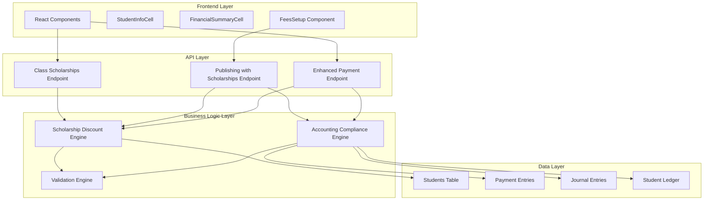

# Design Document

## Overview

The scholarship integration completion system builds upon the existing Elite Scholar School Management System to provide seamless scholarship discount application throughout the billing and payment workflow. The system leverages the existing database schema with scholarship fields in the students table and extends the current ORM-based payment processing architecture to include scholarship-aware calculations and GAAP-compliant accounting treatment.

The design focuses on completing the missing backend API endpoints that the frontend is already calling, ensuring that scholarship discounts are automatically applied during fee publishing, properly reflected in invoices, and correctly processed during payments while maintaining full accounting compliance.

## Architecture

### High-Level Architecture



### Component Integration

The system integrates with existing components:

1. **Frontend Components**: Already implemented and calling missing API endpoints
2. **ORM Payments Controller**: Extended to support scholarship calculations
3. **Accounting Compliance System**: Enhanced to handle scholarship contra-revenue entries
4. **Student Management**: Leverages existing scholarship fields in students table

## Components and Interfaces

### 1. Class Scholarships API Endpoint

**Purpose**: Retrieve students with active scholarships for a specific class

**Interface**:
```javascript
GET /api/students/class-scholarships
Query Parameters:
- class_code: string (required)
- school_id: string (required) 
- branch_id: string (optional)

Response:
{
  success: boolean,
  data: [
    {
      admission_no: string,
      student_name: string,
      scholarship_percentage: number,
      scholarship_type: string,
      scholarship_start_date: date,
      scholarship_end_date: date,
      scholarship_notes: string
    }
  ]
}
```

**Implementation**: New controller method in StudentController.js

### 2. Enhanced Publishing with Scholarships Endpoint

**Purpose**: Publish fees with automatic scholarship discount application

**Interface**:
```javascript
POST /api/accounting/compliance/publish-separated-transactions-with-scholarships
Body:
{
  transaction_type: string,
  class_code: string,
  term: string,
  academic_year: string,
  transactions: array,
  journal_entries: array,
  scholarship_integration: {
    enabled: boolean,
    students_with_scholarships: number,
    total_scholarship_discount: number,
    scholarship_students: array
  },
  compliance_verification: object,
  accounting_summary: object
}

Response:
{
  success: boolean,
  message: string,
  scholarship_applied: boolean,
  total_discount: number,
  affected_students: number
}
```

**Implementation**: New method in AccountingComplianceController.js

### 3. Enhanced Payment Processing Endpoint

**Purpose**: Process payments with scholarship-adjusted amounts

**Interface**:
```javascript
POST /api/studentpayment/enhanced-with-ledger-and-scholarships
Body:
{
  code: number,
  class_code: string,
  term: string,
  academic_year: string,
  transaction_type: string,
  create_journal_entries: boolean,
  create_student_ledger_entries: boolean,
  update_inventory: boolean,
  apply_scholarships: boolean,
  journal_entries: array,
  scholarship_data: object,
  compliance_metadata: object
}

Response:
{
  success: boolean,
  message: string,
  payment_entries_created: number,
  scholarship_discounts_applied: number,
  journal_entries_created: number
}
```

**Implementation**: Enhanced method in ORMPaymentsController.js

### 4. Scholarship Discount Engine

**Purpose**: Core business logic for scholarship calculations

**Interface**:
```javascript
class ScholarshipDiscountEngine {
  calculateDiscount(baseAmount, scholarshipPercentage): number
  validateScholarship(scholarshipData): ValidationResult
  isScholarshipActive(scholarship, currentDate): boolean
  applyScholarshipToTransaction(transaction, scholarship): TransactionWithDiscount
  generateScholarshipJournalEntries(discountAmount, reference): JournalEntry[]
}
```

**Key Methods**:
- `calculateDiscount()`: Applies percentage to base amount
- `validateScholarship()`: Ensures scholarship data integrity
- `isScholarshipActive()`: Checks date ranges and status
- `applyScholarshipToTransaction()`: Modifies transaction with discount
- `generateScholarshipJournalEntries()`: Creates GAAP-compliant entries

### 5. Accounting Compliance Engine

**Purpose**: Ensures GAAP compliance for scholarship transactions

**Interface**:
```javascript
class AccountingComplianceEngine {
  validateDoubleEntry(journalEntries): ValidationResult
  createScholarshipContraRevenueEntry(amount, reference): JournalEntry
  validateAccountCodes(entries): ValidationResult
  generateAuditTrail(transaction): AuditEntry
  ensureTransactionSeparation(transactions): ValidationResult
}
```

**Key Features**:
- Double-entry bookkeeping validation
- Contra-revenue account (4150) for scholarships
- Audit trail generation
- Transaction type separation enforcement

## Data Models

### Enhanced Student Model (Existing)

```sql
-- Students table already has scholarship fields
scholarship_percentage DECIMAL(5,2) DEFAULT 0.00
scholarship_type ENUM('None','Merit','Need-based','Sports','Academic','Other') DEFAULT 'None'
scholarship_start_date DATE DEFAULT NULL
scholarship_end_date DATE DEFAULT NULL
scholarship_notes TEXT DEFAULT NULL
```

### Scholarship Transaction Model

```javascript
{
  admission_no: string,
  base_amount: number,
  scholarship_percentage: number,
  scholarship_discount: number,
  net_amount: number,
  scholarship_type: string,
  applied_date: timestamp,
  reference: string
}
```

### Enhanced Journal Entry Model

```javascript
{
  account: string,
  account_code: string,
  account_type: string, // 'Contra-Revenue' for scholarships
  debit: number,
  credit: number,
  description: string,
  reference: string,
  transaction_date: date,
  scholarship_related: boolean // New field
}
```

### Payment Entry Enhancement

```javascript
// Additional fields for scholarship tracking
{
  gross_amount: number,        // Original amount before scholarship
  scholarship_discount: number, // Discount applied
  net_amount: number,          // Final amount after discount
  scholarship_reference: string // Link to scholarship application
}
```

## Correctness Properties

*A property is a characteristic or behavior that should hold true across all valid executions of a system-essentially, a formal statement about what the system should do. Properties serve as the bridge between human-readable specifications and machine-verifiable correctness guarantees.*

### Property Reflection

After analyzing all acceptance criteria, I identified several areas where properties could be consolidated to eliminate redundancy:

- **Calculation Properties**: Properties 1 and 5 both deal with scholarship calculations and can be combined into a comprehensive calculation property
- **Validation Properties**: Properties 2 and 4 both handle data validation and can be merged into a single validation property  
- **Accounting Properties**: Properties 3 and 10 both address GAAP compliance and can be consolidated
- **API and Error Properties**: Properties 6 and 7 both deal with system responses and can be combined
- **Audit Properties**: Property 8 stands alone as it provides unique validation value

### Property 1: Comprehensive Scholarship Calculation Accuracy
*For any* valid scholarship percentage (0-100) and base amount, the calculated discount should equal (base amount × percentage ÷ 100), the net amount should equal (base amount - discount), the discount should never exceed the base amount, and the net amount should never be negative
**Validates: Requirements 4.1, 4.5, 7.4**

### Property 2: Comprehensive Scholarship Validation
*For any* scholarship data, it should only be considered valid and active if scholarship_type is not 'None' or null, scholarship_percentage is between 0 and 100, the current date falls within start/end date range (if specified), and if both dates are provided, start_date is before end_date
**Validates: Requirements 1.3, 1.4, 1.5, 7.1, 7.2**

### Property 3: GAAP Compliance and Transaction Separation
*For any* set of journal entries containing scholarship discounts, the total debits must equal total credits, scholarship discounts must use account code 4150 as contra-revenue, and scholarship entries must be created separately from fee revenue entries
**Validates: Requirements 5.1, 5.2, 5.3, 2.2**

### Property 4: System Response Completeness and Error Handling
*For any* scholarship operation, successful responses must include success status and scholarship metadata when applicable, failed operations must provide meaningful error messages and prevent data corruption, and the system must gracefully degrade to non-scholarship processing when scholarship services are unavailable
**Validates: Requirements 6.4, 6.5, 9.1, 9.2, 9.4**

### Property 5: Scholarship Data Processing Consistency
*For any* class with scholarship students, the system should return all students with complete scholarship details, automatically apply discounts during publishing, record both gross and net amounts in ledger entries, and maintain consistent formatting in receipts and reports
**Validates: Requirements 1.1, 1.2, 2.1, 3.1, 3.2, 3.3**

### Property 6: Accounting Integration Completeness
*For any* scholarship transaction, the system should create proper contra-revenue entries, reduce accounts receivable by scholarship amounts, maintain complete audit trails, and ensure all transactions have proper journal entry references
**Validates: Requirements 2.2, 2.3, 3.4, 8.2, 8.5**

### Property 7: Performance and Scalability Requirements
*For any* class size or system load, scholarship calculations should complete within 30 seconds, concurrent operations should maintain performance, and bulk operations should process efficiently using batch operations
**Validates: Requirements 10.1, 10.2, 10.4**

### Property 8: Reporting and Audit Trail Consistency
*For any* scholarship-related report, the system should show scholarship discounts as separate line items, provide complete transaction histories, calculate accurate usage rates, and maintain proper contra-revenue classification
**Validates: Requirements 8.1, 8.3, 8.4**

## Error Handling

### Error Categories

1. **Validation Errors**
   - Invalid scholarship percentages (< 0 or > 100)
   - Invalid date ranges
   - Missing required fields
   - Invalid account codes

2. **Business Logic Errors**
   - Inactive scholarships
   - Expired scholarships
   - Calculation overflows
   - Double-entry imbalances

3. **System Errors**
   - Database connection failures
   - API endpoint unavailability
   - Transaction rollback failures
   - Performance timeouts

### Error Handling Strategy

```javascript
// Graceful degradation pattern
try {
  const scholarshipData = await getClassScholarships(classCode);
  return await publishWithScholarships(data, scholarshipData);
} catch (scholarshipError) {
  console.warn('Scholarship integration failed, proceeding without scholarships:', scholarshipError);
  return await publishWithoutScholarships(data);
}
```

### Error Response Format

```javascript
{
  success: false,
  error: {
    code: 'SCHOLARSHIP_VALIDATION_ERROR',
    message: 'Scholarship percentage must be between 0 and 100',
    details: {
      field: 'scholarship_percentage',
      value: 150,
      constraint: 'range_0_100'
    }
  },
  fallback_available: true
}
```

## Testing Strategy

### Dual Testing Approach

The system requires both unit testing and property-based testing for comprehensive coverage:

**Unit Tests**: Focus on specific examples, edge cases, and integration points
- Test specific scholarship percentage calculations (10%, 50%, 100%)
- Test date validation edge cases (null dates, invalid ranges)
- Test API endpoint responses with known data
- Test error handling with specific failure scenarios

**Property Tests**: Verify universal properties across all inputs
- Test scholarship calculation accuracy across random percentages and amounts
- Test GAAP compliance across random journal entry sets
- Test data validation across random scholarship data
- Test performance across random class sizes

### Property-Based Testing Configuration

- **Minimum 100 iterations** per property test due to randomization
- **Test Library**: Use fast-check for JavaScript property-based testing
- **Tag Format**: `Feature: scholarship-integration-completion, Property {number}: {property_text}`

### Test Categories

1. **Scholarship Calculation Tests**
   - Property: Discount calculation accuracy
   - Property: Net amount consistency
   - Unit: Specific percentage calculations

2. **Data Validation Tests**
   - Property: Scholarship data integrity
   - Property: Active scholarship validation
   - Unit: Specific validation scenarios

3. **API Integration Tests**
   - Property: API response completeness
   - Unit: Specific endpoint behaviors
   - Unit: Error response formats

4. **Accounting Compliance Tests**
   - Property: GAAP compliance validation
   - Property: Transaction separation enforcement
   - Unit: Specific journal entry scenarios

5. **Performance Tests**
   - Property: Performance within limits
   - Unit: Specific load scenarios
   - Unit: Timeout handling

### Example Property Test

```javascript
// Feature: scholarship-integration-completion, Property 1: Scholarship discount calculation accuracy
test('scholarship discount calculation is always accurate', () => {
  fc.assert(fc.property(
    fc.float({ min: 0.01, max: 100000 }), // base amount
    fc.float({ min: 0, max: 100 }),       // scholarship percentage
    (baseAmount, percentage) => {
      const discount = calculateScholarshipDiscount(baseAmount, percentage);
      const expectedDiscount = (baseAmount * percentage) / 100;
      
      // Property: Discount should equal expected calculation
      expect(Math.abs(discount - expectedDiscount)).toBeLessThan(0.01);
      
      // Property: Discount should never exceed base amount
      expect(discount).toBeLessThanOrEqual(baseAmount);
      
      // Property: Discount should never be negative
      expect(discount).toBeGreaterThanOrEqual(0);
    }
  ));
});
```