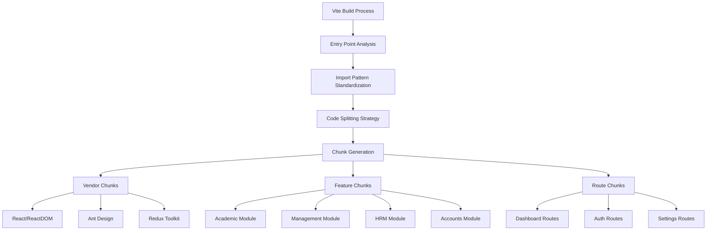
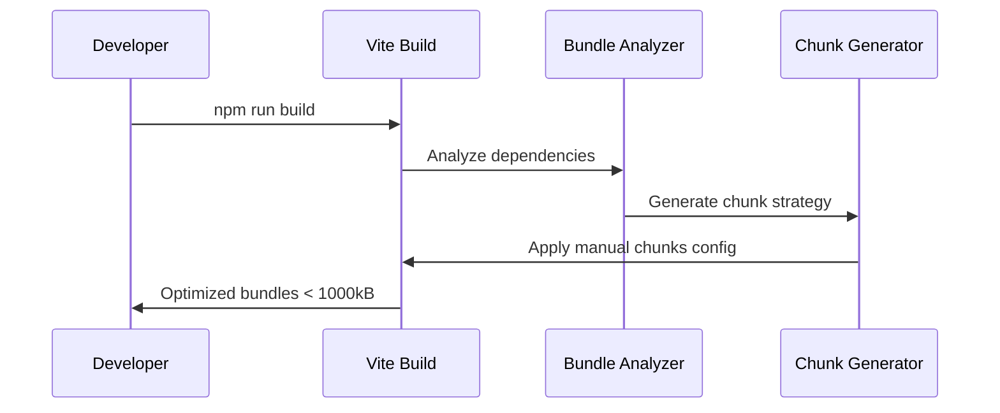

# Design Document: Vite Build Optimization

## Overview

This design addresses the Vite build optimization challenges in the Elite Scholar React application by implementing strategic code splitting, standardizing import patterns, and optimizing bundle configurations. The solution focuses on reducing bundle sizes below 1000 kB thresholds while maintaining application functionality and improving development experience.

The current application suffers from mixed import patterns in router files, oversized chunks, and inefficient code splitting. The optimization strategy involves restructuring the Vite configuration, standardizing lazy loading patterns, and implementing intelligent chunk splitting based on feature modules and usage patterns.

## Architecture

### High-Level Architecture



### Build Optimization Flow



## Components and Interfaces

### 1. Vite Configuration Module

**Purpose**: Central configuration for build optimization and chunk management.

**Key Components**:
- `ManualChunksConfig`: Defines how modules are grouped into chunks
- `BuildOptimizationConfig`: Configures build-specific optimizations
- `DevelopmentConfig`: Optimizes development server performance

**Interface**:
```typescript
interface ViteBuildConfig {
  manualChunks: ManualChunksFunction;
  chunkSizeWarningLimit: number;
  rollupOptions: RollupOptions;
  optimizeDeps: OptimizeDepsConfig;
}

interface ChunkStrategy {
  vendor: string[];
  features: Record<string, string[]>;
  routes: Record<string, string[]>;
}
```

### 2. Router Optimization Module

**Purpose**: Standardizes import patterns and implements consistent lazy loading.

**Key Components**:
- `LazyComponentFactory`: Creates optimized lazy-loaded components
- `RouteChunkMapper`: Maps routes to appropriate chunks
- `ImportPatternStandardizer`: Ensures consistent import patterns

**Interface**:
```typescript
interface OptimizedRouteConfig {
  path: string;
  component: LazyExoticComponent<ComponentType<any>>;
  chunk: string;
  preload?: boolean;
  fallback: ComponentType;
}

interface LazyLoadingConfig {
  retries: number;
  timeout: number;
  fallbackComponent: ComponentType;
}
```

### 3. Bundle Analysis Module

**Purpose**: Monitors and reports bundle performance metrics.

**Key Components**:
- `BundleAnalyzer`: Analyzes chunk sizes and dependencies
- `PerformanceMonitor`: Tracks build and runtime performance
- `OptimizationReporter`: Generates optimization recommendations

**Interface**:
```typescript
interface BundleAnalysisReport {
  chunks: ChunkInfo[];
  totalSize: number;
  warnings: string[];
  recommendations: OptimizationRecommendation[];
}

interface ChunkInfo {
  name: string;
  size: number;
  modules: string[];
  isOverSized: boolean;
}
```

## Data Models

### Chunk Configuration Model

```typescript
interface ChunkConfiguration {
  // Vendor libraries - stable, rarely changing
  vendor: {
    react: ['react', 'react-dom', 'react-router-dom'];
    ui: ['antd', '@ant-design/icons', 'bootstrap'];
    state: ['@reduxjs/toolkit', 'react-redux'];
    utils: ['axios', 'dayjs', 'lodash-es'];
  };
  
  // Feature modules - grouped by functionality
  features: {
    academic: string[];
    management: string[];
    hrm: string[];
    accounts: string[];
    communications: string[];
  };
  
  // Route-level chunks - lazy loaded
  routes: {
    dashboards: string[];
    auth: string[];
    settings: string[];
    reports: string[];
  };
}
```

### Import Pattern Model

```typescript
interface ImportPattern {
  type: 'static' | 'dynamic';
  module: string;
  usage: 'utility' | 'component' | 'route';
  chunkTarget?: string;
}

interface RouteImportConfig {
  path: string;
  componentPath: string;
  importType: 'dynamic';
  dependencies: string[];
  chunkName: string;
}
```

### Performance Metrics Model

```typescript
interface BuildMetrics {
  bundleSize: {
    total: number;
    chunks: Record<string, number>;
    warnings: string[];
  };
  
  buildTime: {
    total: number;
    phases: Record<string, number>;
  };
  
  optimization: {
    treeshakingEfficiency: number;
    codeReduction: number;
    chunkUtilization: number;
  };
}
```

## Error Handling

### Build Error Management

1. **Chunk Size Violations**
   - Monitor chunk sizes during build
   - Provide specific recommendations for oversized chunks
   - Suggest module redistribution strategies

2. **Import Resolution Failures**
   - Detect circular dependencies
   - Identify missing dynamic import patterns
   - Provide clear error messages with fix suggestions

3. **Lazy Loading Failures**
   - Implement retry mechanisms for failed chunk loads
   - Provide fallback components for critical routes
   - Log loading failures for monitoring

### Runtime Error Handling

```typescript
interface ErrorBoundaryConfig {
  fallbackComponent: ComponentType<ErrorFallbackProps>;
  onError: (error: Error, errorInfo: ErrorInfo) => void;
  retryable: boolean;
}

interface ChunkLoadingError {
  chunkName: string;
  error: Error;
  retryCount: number;
  fallbackStrategy: 'reload' | 'fallback' | 'redirect';
}
```

## Testing Strategy

### Dual Testing Approach

The testing strategy combines unit tests for specific functionality with property-based tests for universal behaviors:

**Unit Tests**:
- Vite configuration validation
- Chunk generation logic
- Import pattern detection
- Bundle size calculations
- Error boundary behavior

**Property-Based Tests**:
- Bundle size constraints across all builds
- Import pattern consistency
- Lazy loading behavior
- Chunk loading performance
- Error recovery mechanisms

### Property-Based Testing Configuration

- **Library**: fast-check for TypeScript property testing
- **Iterations**: Minimum 100 iterations per property test
- **Test Tags**: Each property test references its design document property
- **Tag Format**: `Feature: vite-build-optimization, Property {number}: {property_text}`

### Testing Scenarios

1. **Build Configuration Testing**
   - Test various dependency combinations
   - Validate chunk size limits
   - Verify manual chunk assignments

2. **Runtime Loading Testing**
   - Test lazy loading under various network conditions
   - Validate error recovery mechanisms
   - Test preloading strategies

3. **Performance Testing**
   - Measure bundle loading times
   - Test concurrent chunk loading
   - Validate memory usage patterns

## Correctness Properties

*A property is a characteristic or behavior that should hold true across all valid executions of a system—essentially, a formal statement about what the system should do. Properties serve as the bridge between human-readable specifications and machine-verifiable correctness guarantees.*

### Property 1: Bundle Size Optimization
*For any* build configuration and source code combination, all generated chunks should be smaller than 1000 kB and optimized for parallel loading performance
**Validates: Requirements 1.1, 1.5, 4.5**

### Property 2: Vendor Library Separation
*For any* build output, vendor libraries (React, Ant Design, Redux) should be separated into dedicated chunks distinct from application code
**Validates: Requirements 1.2, 4.1**

### Property 3: Route Component Exclusion
*For any* main application chunk, route-level components should be excluded and loaded dynamically
**Validates: Requirements 1.3**

### Property 4: Feature Module Chunking
*For any* build output, major feature modules (academic, management, hrm, accounts) should each have their own dedicated chunks
**Validates: Requirements 1.4, 4.2**

### Property 5: Import Pattern Consistency
*For any* router configuration, route-level components should use dynamic imports exclusively, utilities should use static imports, and no component should be imported with mixed patterns
**Validates: Requirements 2.1, 2.2, 2.3, 2.4, 2.5**

### Property 6: Lazy Loading Behavior
*For any* route navigation, only the required component and its dependencies should be loaded, with proper loading indicators displayed during fetch
**Validates: Requirements 3.1, 3.2**

### Property 7: Error Recovery Mechanisms
*For any* lazy loading failure, the application should display error boundaries with retry mechanisms while maintaining TypeScript support
**Validates: Requirements 3.3, 3.5**

### Property 8: Critical Route Preloading
*For any* user role and access pattern, critical routes should be preloaded based on the user's permissions and usage patterns
**Validates: Requirements 3.4**

### Property 9: Vite Configuration Completeness
*For any* Vite configuration, manual chunks should be defined for all vendor libraries, feature modules should have dedicated chunks, and appropriate size limits should be set with optimized rollup options
**Validates: Requirements 4.1, 4.2, 4.3, 4.4**

### Property 10: Router System Optimization
*For any* router system, multiple router files should be consolidated into a single optimized structure with consistent lazy loading patterns, proper error boundaries, and route-based code splitting with loading states
**Validates: Requirements 5.1, 5.2, 5.3, 5.4, 5.5**

### Property 11: Build Analysis and Monitoring
*For any* build process, bundle analysis reports should be generated showing chunk sizes and dependencies, with warnings for oversized chunks and highlighted optimization opportunities
**Validates: Requirements 6.1, 6.2, 6.5**

### Property 12: Build Performance Tracking
*For any* build execution, build time improvements should be tracked and reported, with unused code identified and removal suggestions provided
**Validates: Requirements 6.3, 6.4**

### Property 13: Development Server Performance
*For any* development session, the server should perform fast hot module replacement, optimize dependency pre-bundling for faster startup, and skip unnecessary optimizations for speed
**Validates: Requirements 7.1, 7.3, 7.5**

### Property 14: Development Debugging Support
*For any* development build, proper source maps should be maintained for debugging and clear error messages should be provided for import-related issues
**Validates: Requirements 7.2, 7.4**

### Property 15: Backward Compatibility Preservation
*For any* optimization implementation, all existing route functionality, authentication flows, error handling, browser compatibility, and integrations should be preserved without breaking changes
**Validates: Requirements 8.1, 8.2, 8.3, 8.4, 8.5**